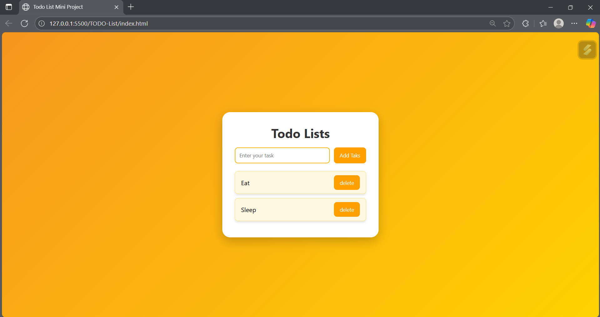

# TODO-List

Todo List Application is a beginner-friendly project built with HTML, CSS, and JavaScript. It implements core task management features like add, delete, and mark complete while practicing JavaScript fundamentals such as DOM manipulation, event handling, and array operations.

## Preview Output Images

## Preview Output ScreenShot

